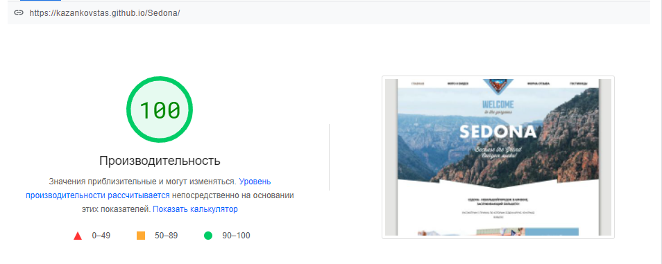

# SEDONA

  

    
  

## <a href="https://kazankovstas.github.io/Sedona/">
    View Live
  </a>

## Описание
#### Учебный проект «Седона» был выполнен в рамках пройденного онлайн‑курса «Продвинутый HTML и CSS» от HTML Academy.

- Адаптивность сетки: мобильная, планшетная и десктопная версии (responsive layout).
- Адаптивность графики: ретинизация, векторные изображения.
- Используемая методология: БЭМ.
- Используемый препроцессор: Sass.
- Используемый инструмент автоматизации: Gulp.

---

 

    
  

## PageSpeed Insights
<table>
  <tr>
    <th>Для компьютеров</th>
    <th>Для мобильных</th>
  </tr>
  <tr valign="top">
    <td>
        
    </td>
    <td>
         
    </td>
  </tr>
</table>
