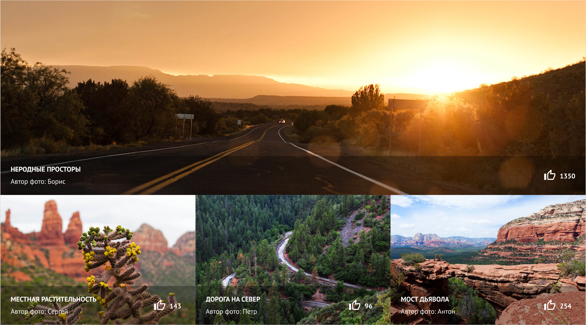

# SEDONA

<a href="https://kazankovstas.github.io/project-Pink/index.html">Ссылка на проект</a>

Sedona - проект, представляющий собой сайт для поиска и бронирования жилья в одноименном заповеднике, который расположен в штате Аризона, США.

- Адаптивность сетки: мобильная, планшетная и десктопная версии (responsive layout).
- Адаптивность графики: ретинизация, векторные изображения.
- Используемая методология: БЭМ.
- Используемый препроцессор: Sass.
- Используемый инструмент автоматизации: Gulp.

 
 

