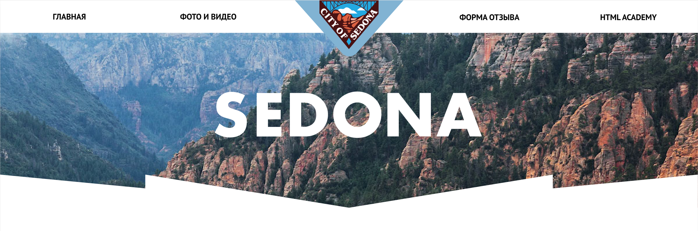
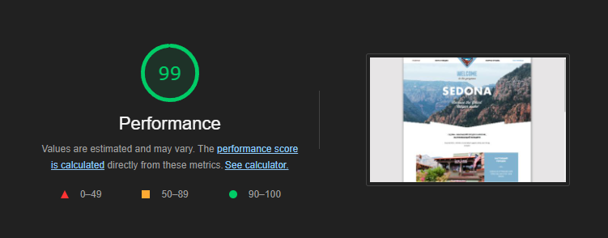

# SEDONA

  

    
  

<a href="https://kazankovstas.github.io/Sedona/">
    View Live
  </a>
---

#### Sedona - проект, представляющий собой сайт для поиска и бронирования жилья в одноименном заповеднике, который расположен в штате Аризона, США.

- Адаптивность сетки: мобильная, планшетная и десктопная версии (responsive layout).
- Адаптивность графики: ретинизация, векторные изображения.
- Используемая методология: БЭМ.
- Используемый препроцессор: Sass.
- Используемый инструмент автоматизации: Gulp.

---

 

    
  

